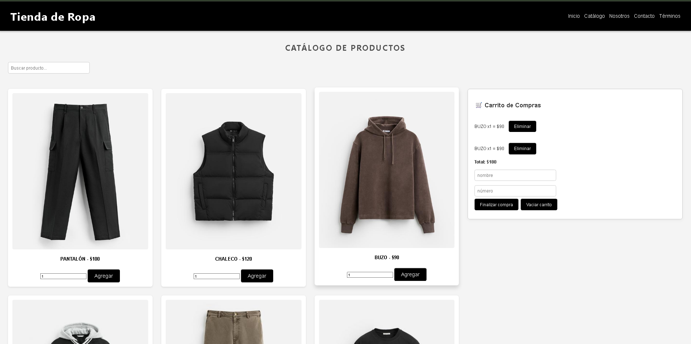

# 🛍️ Tienda de Ropa Moderna - Proyecto Final

Proyecto Final del curso de JavaScript de Coderhouse.  
Simulador interactivo de Ecommerce con catálogo de productos, carrito de compras, confirmación de pedido y almacenamiento en localStorage.

🔗 [Ver sitio online (GitHub Pages)](https://juanmabenta.github.io/tienda-ropa-final-juan25/)

---

## 🧩 Funcionalidades

- Renderizado dinámico del catálogo desde un archivo JSON.
- Agregar y quitar productos al carrito.
- Calcular total y confirmar compra.
- Guardar nombre del cliente y mostrar resumen final.
- Almacenamiento del carrito con `localStorage`.
- Uso de la librería **SweetAlert2** para notificaciones personalizadas.
- Diseño responsive y estructura moderna.

---

## 💻 Tecnologías usadas

- HTML5  
- CSS3  
- JavaScript ES6+  
- JSON (simulación de datos)  
- SweetAlert2

---

## 🗂️ Estructura del proyecto

ProyectoFinalBentaberry/
│
├── css/
│ └── style.css
├── data/
│ └── productos.json
├── img/
│ └── (imágenes de productos y logo)
├── js/
│ └── main.js
├── index.html
└── README.md

yaml
Copiar
Editar

---

## 📸 Captura del proyecto

## 👨‍💻 Autor

**Juan Manuel Bentaberry**  
Entrega final del curso de JavaScript  
[Código en GitHub](https://github.com/juanmabenta/tienda-ropa-final-juan25)
